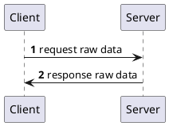
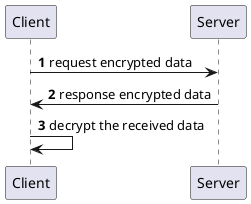
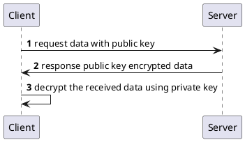
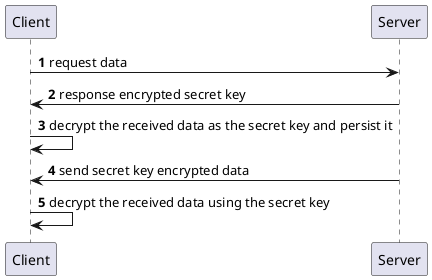
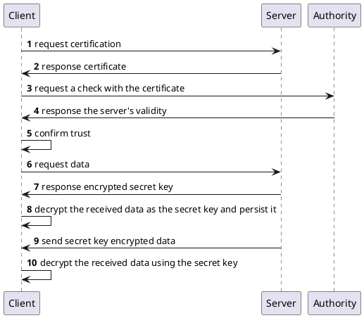

# Notes

## The Basic Concepts

- HTTPS (Hyper Text Transfer Protocol *Secure*) is a protocol to transfer text
  securely on the internet. It is safer than HTTP (Hyper Text Transfer Protocol)
  since it is "secured" by TLS/SSL, which is another protocol for data security.
- TLS/SSL uses both symmetric-key algorithm and asymmetric-key algorithm to
  transfer data. The idea is:
  1. The client requests some data with its public key
  2. The server generates a mutual secret key for symmetric-key algorithm
  3. The server sends the mutual key to the client, using the asymmetric-key
     algorithm
  4. The server encrypts the data using a symmetric-key algorithm
  5. The server sends the encrypted data to the client
  6. The client decrypts the data sent by the server, using the received key
- The problem with the idea: how can the client be sure that when he send his
  requests to a server, he is sending them to the right one?
- The solution for the problem: the server should have something to prove
  himself, and the client should be able to use it, or in another word, a
  certificate. The certificate will tell the client if 

### The Simplest Communication Version

The problem with this is easy to see: data is not encrypted and it is easy to
intercepted the communication.

### The Simplified Ideal Version

We see another problem with this however: both client and server question each
other on how to encrypt and decrypt the data. 

### A More Detailed Version

There should not be any problem with this approach, however, if the algorithm
was not so slow! Symmetric-key algorithm is faster, but using it alone bring
us back to the first version's problem: no way of letting both parties having
the same key. If only we can somehow combine the asymmetric-key algorithm's
security and the symmetric-key algorithm's speed... Actually, we can.

### The "Real-Life" Version

This should be enough for you to understand TLS/SSL and how most stuff works
in real life. I must take one step further, however, and ask the question:
how can we know if the server is not being faked by anyone? This is where a
certificate comes in.

### The Extended "Real-Life" Version

## Others

- Use `mkcert`
- Use `Kestrel` in .NET Core

## Keywords

- HTTP
- HTTPS
- TLS/SSL
- symmetric-key and asymmetric-key algorithms
- TLS/SSL handshake
- HTTPS certificates

## References

- https://www.websecurity.digicert.com/security-topics/what-is-ssl-tls-https
- https://www.cloudflare.com/learning/ssl/transport-layer-security-tls/
- https://hackernoon.com/how-does-rsa-work-f44918df914b
- https://en.wikipedia.org/wiki/Symmetric-key_algorithm
- https://en.wikipedia.org/wiki/Public-key_cryptography
- https://pradeeploganathan.com/aspnetcore/https-in-asp-net-core-31/
